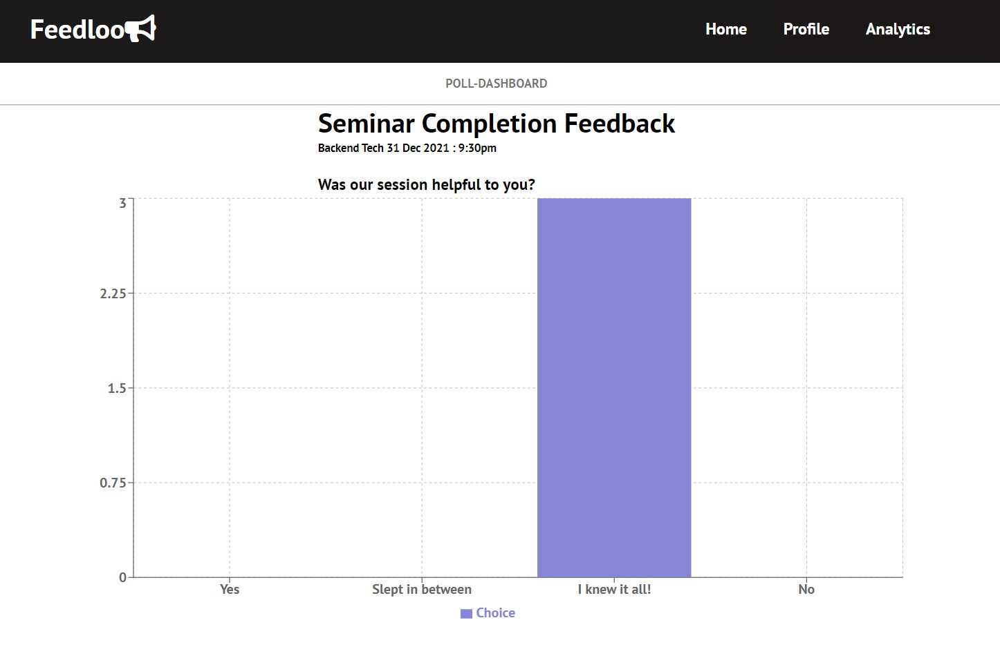

# FeedLoop

Application to create custom feedback form/poll for personal
improvement and taking actions based on historical data provided.
We mostly wanted target this for

1. Interviewer
2. Interviewee
3. In person meetings
4. Phone calls

- [x] Creating Poll/Form 
- [X] Editing/Viewing
- [X] Auth2 with Google
- [ ] Analytics (ML)

***(If anyone wants to add analytics functionality I be very happy to accept that PR)***

[BrainStorming-Doc] [1]

## Demo

### 1. Landing Page 

### 2. Feed Page

### 3. Create Form/Poll

### 4. Profile

### 5. View Poll

[1]: https://docs.google.com/document/d/1G9zst4AgOYR13vBQNpGcKgE_avX-yEcpXnEIidzDHQ0/edit?usp=sharing